# Stupid Ideas - and what to learn from them
# Fractal Reservoir Topologies for Analog Hybrid Hardware: Buildable, Not Magical


---


> *Please note that this text is an exploratory trip;
> it makes no claim to be academic, nor does it come close to being so.
> It is created purely out of interest.*


---

## What it is all about

We investigate whether a neural network with a **cosmic-web fractal topology**
(hierarchical, radially self-similar μ/ε/ι clusters with a τ time-constant
gradient) offers an advantage as a reservoir computer — either computationally
(Goal 1) or as analog-buildable hardware (Goal 2). Across ten controlled
experiments (memory-capacity ablations, hardware-layout analyses, REDAC mapping,
an RC energy proxy, and in-situ learning) we reach a clear, sobering, yet positive
overall picture:

**Computationally, the fractal structure offers no advantage.** Against an
equally-sized random reservoir it even loses slightly (memory capacity 5.14 vs.
5.47; for long memory 58% vs. 99%). Higher resolution saturates early, and local
in-situ learning (Hebbian, ADR-8) — tested fairly on stable numerics — yields
**no** gain.

**Physically, the structure is clearly superior to build.** It wires **~11×
shorter** than a globally-connected reservoir, is **~90% locally mappable onto
crossbar tiles** (fits in 2 cascaded REDAC units), and needs only **~200 long
inter-tile links**. This advantage is primarily a **locality effect** (any local
network achieves it); the *hierarchy* adds only ~1.3× beyond that. Energetically
the total advantage remains **modest (~1.1×)**, because converters and quiescent
current dominate ~83% independent of topology.

**Conclusion:** the value of the fractal topology lies in **routability and area**
(it makes the compact analog build feasible at all), **not** in a "cosmically
magical" compute advantage. Removing the interneuron type ι saves ⅓ of the
hardware and ⅓ of the energy with no measurable loss of computation. The validated
REDAC substrate is lab/rack-scale; the geometric routability advantage is, however,
**scale-invariant** and carries 1:1 to a later on-chip layout.

---

## 1. Background and Goals

Starting from the esoteric notion that there is a visual–morphological resemblance
between the fractal images of neuron assemblies in the brain and the mass
concentrations at the nodes of cosmic filaments[^r13], we investigated whether this
resemblance can actually be put to use — to act as something like a neural network.

The starting hypothesis (`CONCEPT.md`): a topology modeled on the cosmic web
(filaments, clusters, voids) could serve as a hardware-efficient,
predictive/streaming learning-capable model on analog hybrid hardware (memristor/REDAC)[^r8][^r9][^r10].
Two testable goals:

- **Goal 1 (compute):** does the fractal topology contribute *as a computational
  structure*?
- **Goal 2 (hardware):** is it *buildable* on analog hybrid hardware?

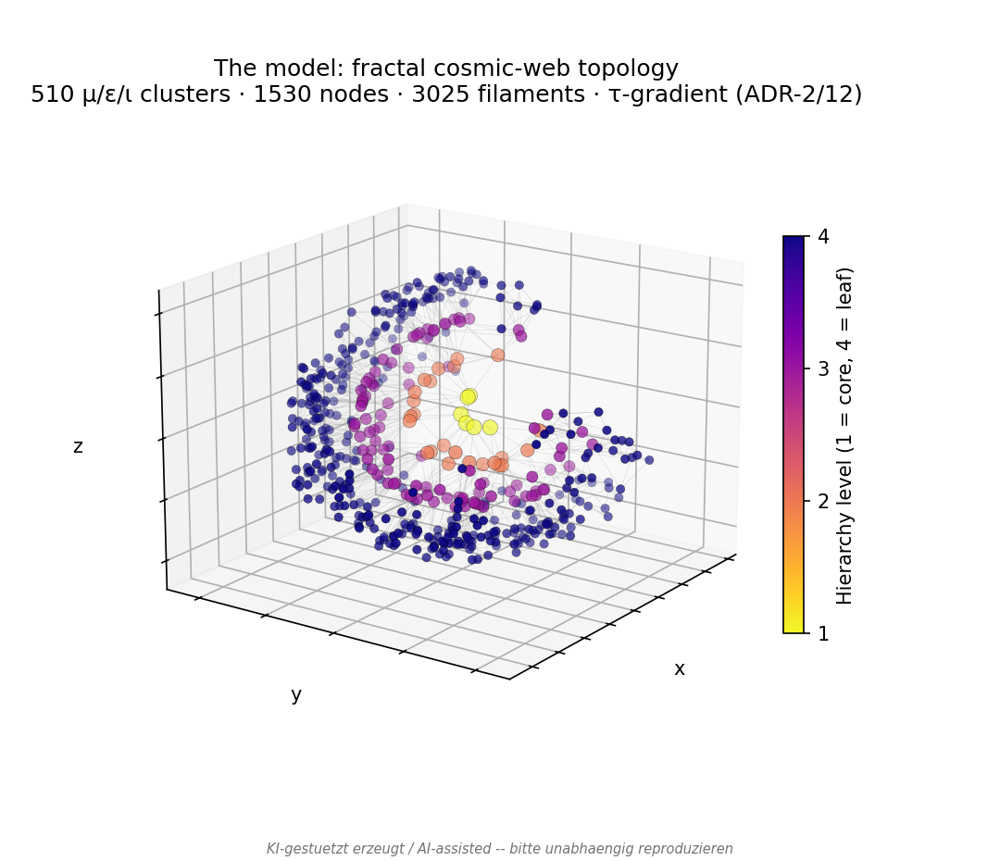

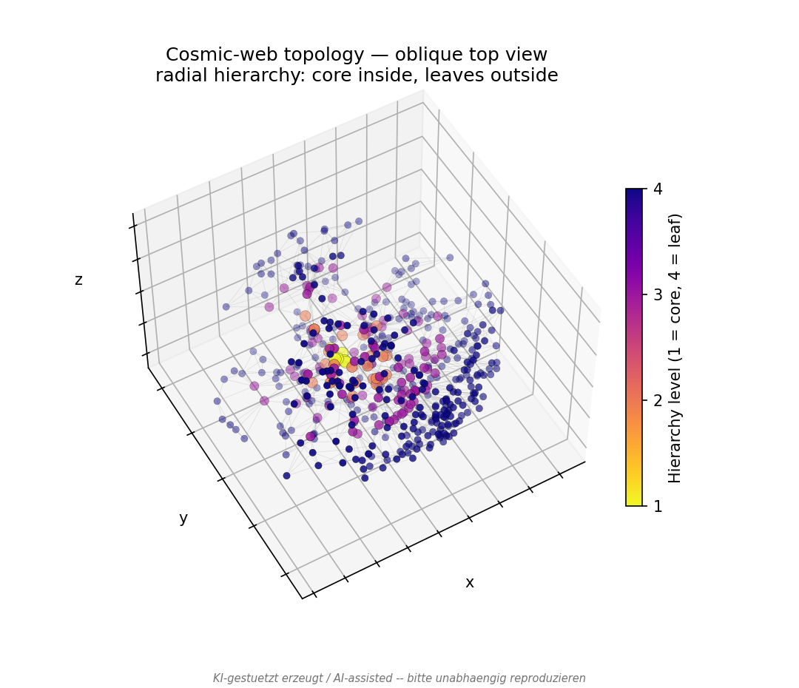

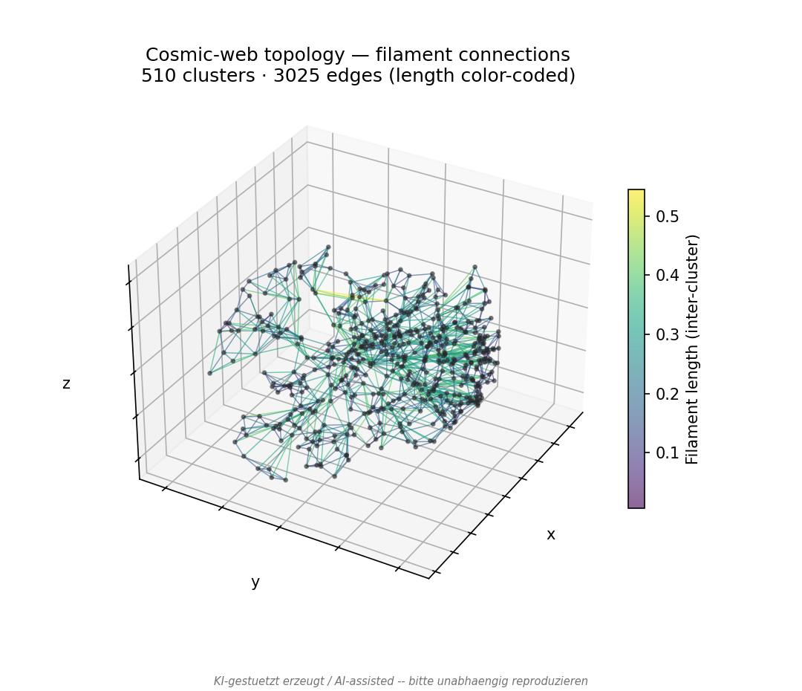

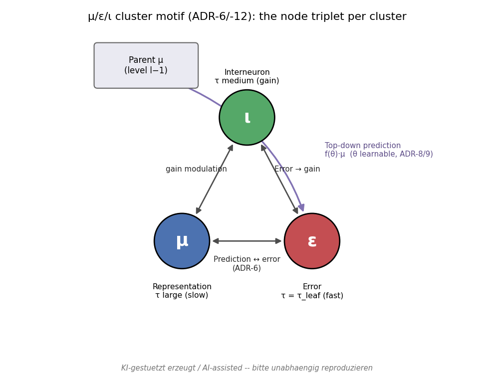

*Figure 1. The model under study — the cosmic-web fractal topology (n_levels=4):
510 μ/ε/ι clusters / 1530 nodes / 3025 filaments. **(a)** 3D render, radial view
(dark core → bright leaves); color = hierarchy level. **(b)** the same topology from
an oblique elevated angle. **(c)** the inter-cluster filament network from a third
angle (edges colored by length). **(d)** the μ/ε/ι cluster motif (ADR-6/-12):
intra-cluster μ↔ε↔ι coupling plus the learnable top-down prediction link
parent-μ → child-ε (ADR-8/9). The point cloud is the analyzed reservoir; the readout
is a separate linear layer.*

<div style="page-break-before: always"></div>

## 2. Methods

All claims rest on deterministic Python simulations (NumPy/CuPy, fixed seeds). The
simulations evaluate a **fixed-reservoir reduction**[^r2][^r5] of the full predictive-coding /
free-energy model[^r1] specified in **Appendix A** (the learning dynamics are tested
separately in B-10[^r7]). Three methodological disciplines underpin credibility:

1. **Ensembles, not single runs.** An early single run made the fractal topology
   appear superior — an 8-graph ensemble exposed it as an outlier (B-3).
2. **Fair controls.** `random-geometric` (local random edges) vs. `random-global`
   separates the contributions of *locality* and *hierarchy* (B-4). Learning tests
   hold the dynamics at the edge of chaos[^r6] to separate gain from structure (B-10).
3. **Rule out artifacts before drawing conclusions.** Early "learning successes"
   (stage 5) were numerical artifacts (Euler saturation, null-fixpoint decode).
   All learning claims were re-measured on the repaired leaky-ESN numerics.

Standard task: **memory-forcing delayed-copy / memory capacity**[^r3] over i.i.d.
inputs (the current token carries 0 information → only genuine reservoir memory
can decode), with an identical Ridge readout.

<div style="page-break-before: always"></div>

## 3. Results

**How to read the results tables.** The central metric is **memory capacity (MC)** —
roughly: "how many past input values the network can still reconstruct from its current
state" (in time steps; **higher = better**, at most = the number of nodes N). **LAG k**
is the delay: how well the input from *k steps ago* can be read back out — the
percentages are that hit rate (e.g. "lag 8: 58%" = the value from eight steps ago is
decoded correctly 58% of the time; chance would be ~17%). The symbols **≫** and **≈**
mean "clearly better than" and "about equal". Everything is compared against fair
reference networks *of the same size* — chiefly **random-sparse** (a plain random
network) and **leaky-only** (decoupled neurons with no reservoir wiring at all).
Example, B-3 row 1: "coupling matters (reservoir ≫ leaky-only)" means the *wiring* does
real work (a proper reservoir clearly beats isolated neurons) — but "fractal ≈
random-sparse" means the fractal shape gives no edge over the random network. For
**NRMSE** values (the NARMA task, §3.5) it is the other way round: **smaller = better**.

### 3.1 Goal 1 — Compute: no fractal advantage

| Finding | Result |
|---------|--------|
| **B-3** topology ablation | Coupling matters (reservoir ≫ pure leaky integrators), but **fractal ≈ random-sparse**; for long memory even worse (lag 8: 58% vs. 99%). MC fractal 5.14 vs. random 5.47. |
| **B-5** resolution scaling | Compute capability saturates early (MC 3.82→4.91→**4.74**, plateau from L3 despite 4× nodes); random wins at *every* resolution. |
| **B-7** multifractal | Heterogeneous branching gives no compute advantage (MC +0.03). |
| **B-10** in-situ learning (ADR-8) | Local Hebbian learning, fair on stable numerics: **no** MC gain (fractal 4.885→4.916, random 5.540→5.540). Weak learning neutral, strong learning harmful. The fixed reservoir is ~optimal. |
| **B-12** "multiverse" scaling | Hierarchically coupling several reservoirs gives nothing naively; *tuned* (timescale gradient + timescale-aligned modular organization) a moderate, **constant** ~+0.8 MC bonus over a same-size flat reservoir. Does not compound — more universes saturate (B-5), a 3rd nesting level is redundant. See §3.4. |
| **B-13** capacity levers | The first *large* levers: a cycle/orthogonal reservoir reaches ~99% of the linear-memory bound MC≈N vs. ~43% for the random/fractal coupling (≈2× for free); and digital delay-taps beat extra reservoir nodes on NARMA (0.55→0.33 vs. 0.54), confirming ADR-3. See §3.5. |

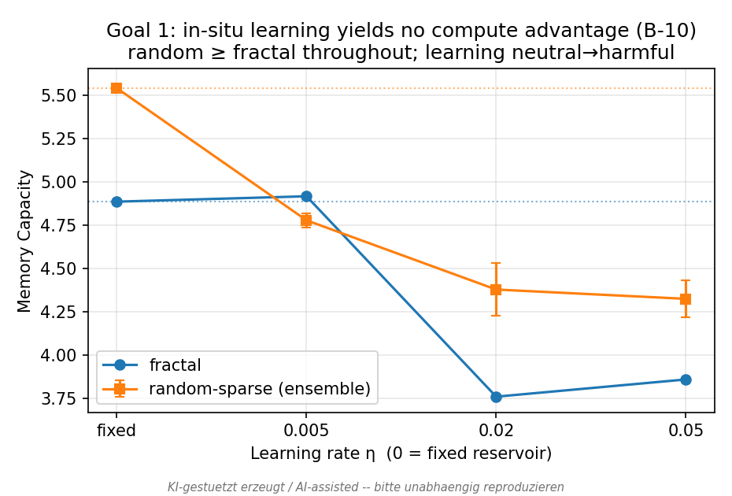

*Figure 2. Goal 1 (B-10). Memory capacity vs. learning rate η for the fractal and
random-sparse reservoirs (random as an ensemble ± std). Random ≥ fractal
throughout; in-situ learning is neutral at the clean edge-of-chaos regime
(η=0.005) and harmful at higher η. Dotted lines = fixed-reservoir baselines.*

<div style="page-break-before: always"></div>

### 3.2 Goal 2 — Hardware: buildable, locality is the lever

| Finding | Result |
|---------|--------|
| **B-4** layout ablation | Fractal wires **11.4× shorter** than random-global, 79.5% of edges local, only 4.7% inter-tile. Control: the advantage is *primarily locality*; hierarchy adds only ~1.3×. |
| **B-6** REDAC mapping | The full network (1530 nodes) fits in **2 cascaded REDACs**. ι (ADR-12) is hardware-expensive (integrator bottleneck + 510 multipliers). |
| **B-7** ι removal | Removing ι saves **⅓ of nodes** at only −0.4% MC → for a pure inference reservoir it is removable. |
| **B-8** tile balancing | Strict balance was needlessly expensive; with capacity slack up to the HW limit the inter-tile cut drops to **~10%** (ι-free: only **203 long links**). |
| **B-9** energy (SPICE proxy) | An 8.7× interconnect advantage → only **1.07× total energy** (converters+quiescent dominate 83%); photonics negligible (0.8%); ι removal saves ~33% energy. Latency topology-neutral (~3.25 µs/token). |

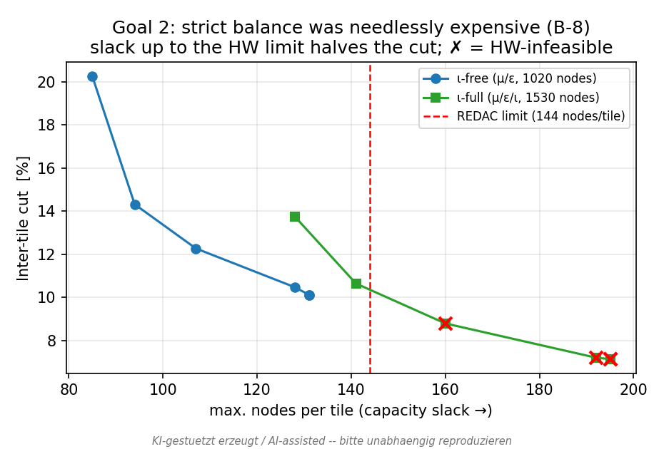

*Figure 3. Goal 2 (B-8). Inter-tile cut vs. maximum nodes per tile (capacity
slack). Relaxing strict balance toward the REDAC hardware limit (144 nodes/tile,
dashed) roughly halves the cut. Red ✗ marks hardware-infeasible operating points.[^r11][^r12]*

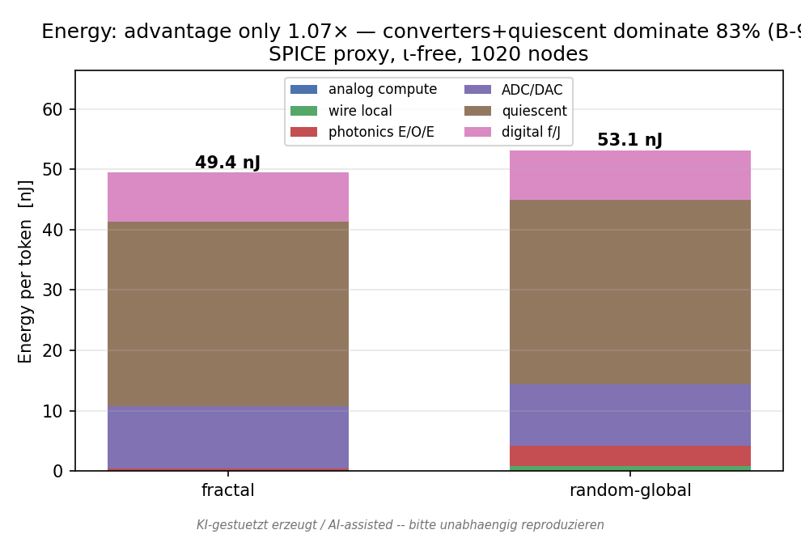

*Figure 4. Energy per token (B-9, SPICE proxy, ι-free, 1020 nodes). Converters
(ADC/DAC) and quiescent current dominate ~83% independent of topology, so the
8.7× interconnect advantage shrinks to a 1.07× total-energy advantage.*

### 3.3 Theoretical framing

**B-1** (expressiveness): qualitatively universal[^r4], with an inductive bias toward
predictive/streaming rather than long-range-retrieval tasks. **B-2** (photonics):
unsuitable for recurrent in-situ compute (E/O/E latency, no optical memory),
surviving only as a multi-chip interconnect — exactly the niche the ~200
inter-tile links (B-8) fill.

### 3.4 Scaling & hierarchical coupling ("multiverse" exploration)

A follow-up explored whether capacity can be raised by **recursive scaling**:
coupling several small reservoirs ("universes") through a few surface ports, and
nesting that. Finding (B-12; full treatment and figures in `MULTIVERSE.md`): naive
coupling helps nothing. *Properly configured* — a timescale gradient across
universes plus timescale-aligned modular organization — a 2-level "multiverse" beats a
same-size, same-edge, same-timescale flat reservoir by a **moderate, constant** margin
(MC ≈ 5.7 vs. ≈ 4.7; the modular organization protects long-memory units from being
swamped by fast dynamics). But the bonus **does not compound**: scaling the number of
universes saturates (consistent with B-5; 4× nodes → only ~2–4% more MC), and a third
nesting level adds nothing (+0.00). On a **nonlinear** task (NARMA-10/20/30) the same
moderate advantage carries over (mv2 beats flat at every order) but *shrinks* with the
memory horizon — largest at short order, fading at long — so it is a general
organizer, not a key to long memory. So hierarchical coupling is a one-off moderate
lever — no exponential and no scaling growth, and it does not change the
reservoir-vs-LLM verdict. Two interface details (`MULTIVERSE.md` §10): memory
capacity is **flat in the number of inter-universe ports** — so the ideal quasar
count is minimal, set by photonic cost, not by capacity (the advantage comes from the
timescale-aligned organization, not from thin bridges); and external I/O bandwidth
scales by adding **independent channels** — total throughput grows sublinearly while
per-channel memory drops (a shared, N-bounded budget). The **top-layer geometry** is
likewise capacity-neutral (`MULTIVERSE.md` §11): whether the universes are wired as a
chain, ring, lattice, all-to-all, or even *cosmic/fractal* by proximity, the MC is
identical (5.67±0.13 across all, spread 0.00) — a third independent confirmation that
the timescale-aligned modular organization carries the advantage, not the macro
coupling pattern. The top layer is thus selectable by pure physics (shortest wiring),
not by geometry.

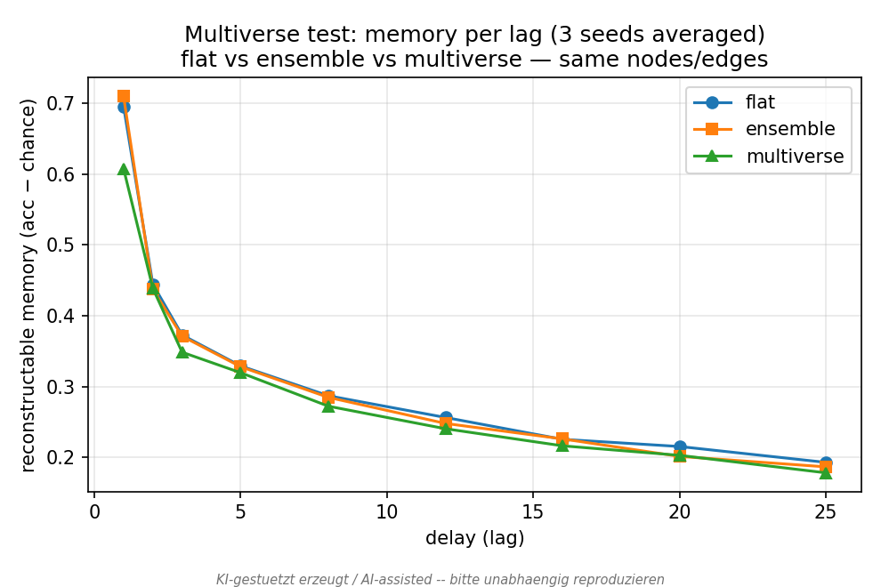

*Figure 6. Naive "multiverse" vs. flat vs. ensemble (fixed leak): macro-loops give no
MC gain — slightly worse (B-12).*

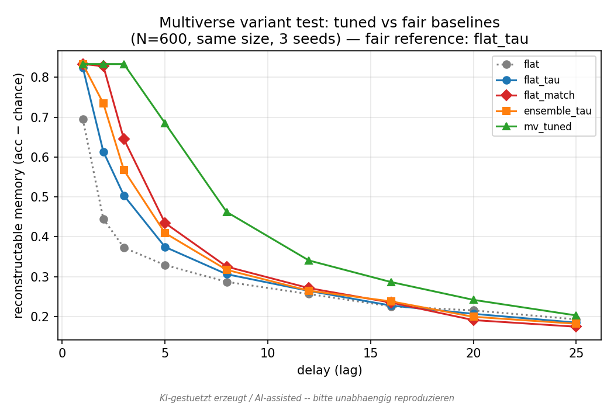

*Figure 7. Tuned "multiverse" (timescale gradient + modular organization) beats even the
fair flat baseline `flat_match` — moderate and constant.*

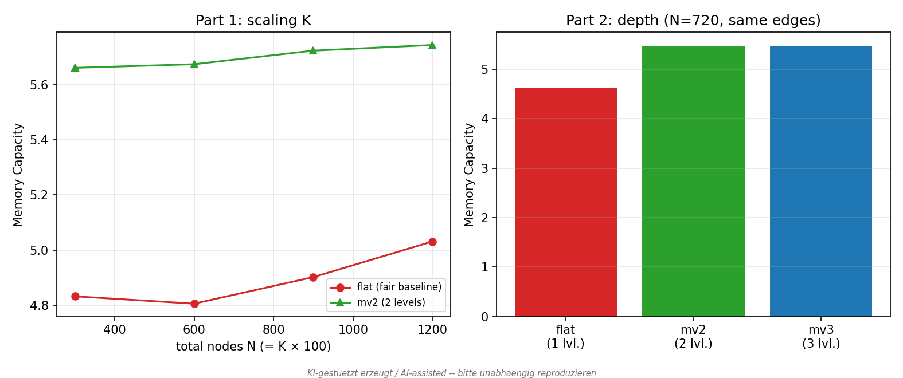

*Figure 8. Left: scaling K — MC saturates (B-5). Right: depth — a 3rd nesting level
adds nothing over 2 levels.*

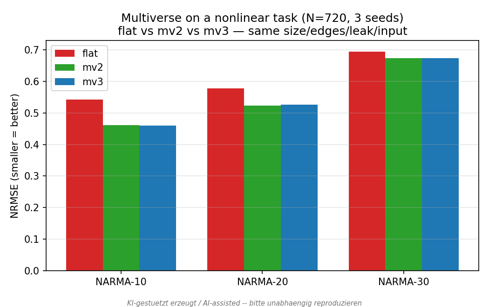

*Figure 9. Nonlinear NARMA-10/20/30: the modular advantage carries over but shrinks
with the memory horizon.*

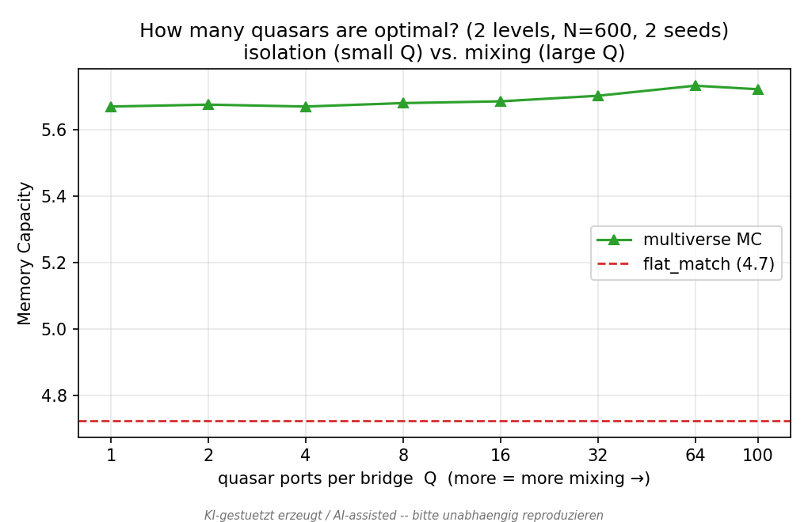

*Figure 10. Quasar-count sweep: MC is flat in the number of inter-universe ports —
the advantage is robust to bridge bandwidth (ideal count = minimal).*

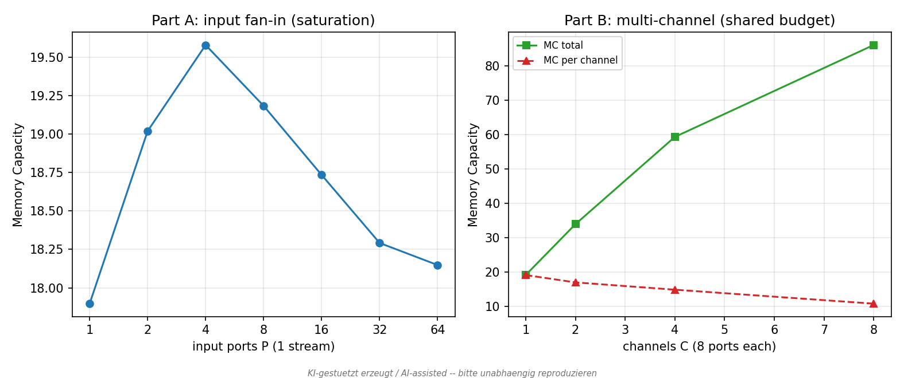

*Figure 11. External I/O bandwidth: input fan-in saturates (~4 ports, left); more
independent channels raise total throughput sublinearly while per-channel memory
drops (shared N-budget, right).*

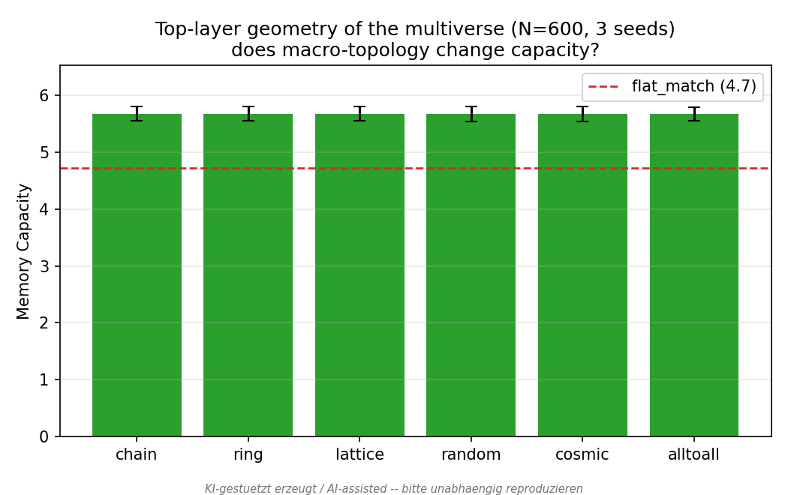

*Figure 12. Top-layer geometry: MC is identical (5.67±0.13) for every macro-topology —
chain, ring, lattice, random, cosmic/fractal, all-to-all. The macro geometry is
capacity-neutral (`MULTIVERSE.md` §11).*

### 3.5 Increasing capacity: the real levers

Two levers actually raise capacity — in contrast to scaling, hierarchy and learning,
all neutral above (B-13, `simulation_capacity.py`).
**(i) Recurrent topology.** A simple cycle (ring) or orthogonal reservoir attains
~96–99% of the theoretical linear-memory bound (MC ≈ N), whereas the random/fractal
coupling used throughout reaches only ~43% (N=100) — i.e. choosing a cycle roughly
**doubles linear memory at the same node count, for free**.
**(ii) External digital memory.** Adding 20 delay taps of the raw input cut NARMA
error from 0.55 to **0.33**, while 20 *extra reservoir nodes* barely moved it (0.54)
— external memory is far more efficient than scaling the reservoir, confirming ADR-3
(long context belongs in digital memory).
**Caveat (memory–nonlinearity trade-off):** the cycle maximizes *linear* memory and
may sacrifice nonlinear capacity, so the efficient design for nonlinear tasks is a
heterogeneous reservoir (for nonlinearity) **plus** delay taps (for memory). The
random/fractal reservoirs used here were thus suboptimal for *linear* memory.

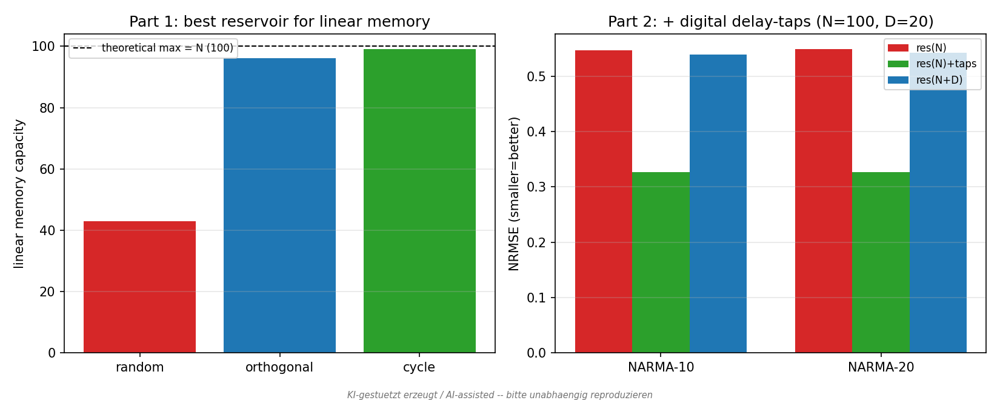

*Figure 13. Capacity levers (B-13). Left: a cycle/orthogonal reservoir reaches ~99%
of the linear-memory bound MC≈N vs. ~43% for random. Right: digital delay-taps beat
extra reservoir nodes on NARMA.*

## 4. Discussion

The fractal topology is a **physical enabler, not a computational miracle.** An
equivalent globally-connected reservoir would require ~11× more wiring — possibly
physically unroutable. The fractal locality makes the compact analog build
feasible at all. The specifically *fractal* (hierarchy) contribution beyond pure
locality is real but small (~1.3×). Energetically the advantage is modest because
the analog-typical fixed costs (converters, quiescent current) dominate — a known
result (G16), here confirmed on the actual topology.
(tbh - it's funny enough that it works at all.)


<div style="page-break-before: always"></div>

## 5. Applications and Design Guidance

The validated artifact is a **fixed-weight reservoir computer** + linear readout.
The original question (Goal 1) was **feasibility** — whether the chosen topology
works as a learning-capable model at all. Answer: as a reservoir, yes; but
the fractal topology gives no compute advantage (B-3) and in-situ learning (ADR-8)
is no lever (B-10). Its realistic
applicability therefore follows from reservoir
computing's niche — **low-power, always-on, streaming temporal inference at
stationary rack scale** — and from the transferable hardware-design lessons.

**Use in the ML stack (attached reservoir computer).** In practice the structure is
not run as a standalone, self-learning model but as a **fixed, front-end reservoir
computer**: the analog core maps an input stream cheaply into a high-dimensional
state, and the **actual learning happens solely at an attached linear readout layer**
(ridge regression; online-capable via RLS/FORCE). This is genuine supervised
learning — fast, cheap, and retrainable per task — but capacity-bounded (Dambre:
usable memory ≤ N) and biased toward predictive/streaming rather than
long-range-retrieval tasks. The recurrent core stays untrained (B-10); switching
tasks means a new readout, not a new reservoir.

**Demonstrated use cases (simulation_demo_edge.py).** On the existing fractal
reservoir with a simple linear (Ridge) readout:

| Task | Metric | Result |
|------|--------|--------|
| NARMA-10 nonlinear time-series prediction | NRMSE (↓) | 0.47 (fractal) vs. 0.39 (random) — both solve it |
| Vibration anomaly detection (predictive maintenance): one-step predictor trained on healthy data; anomaly = prediction-residual spike | ROC-AUC (↑) | **0.99** |

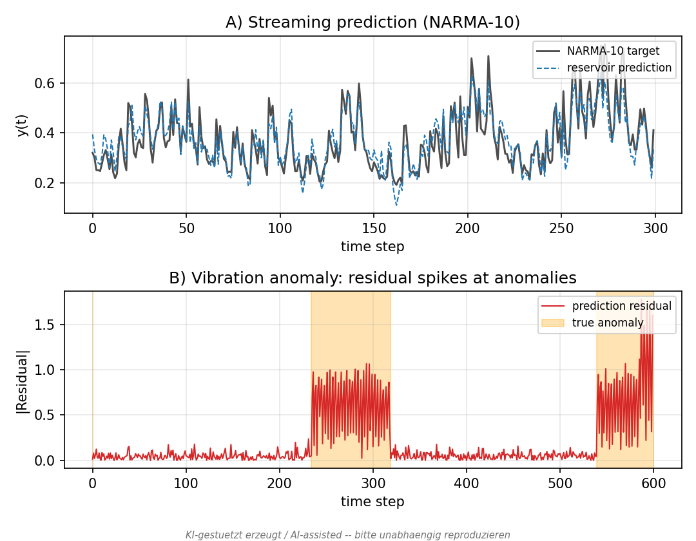

*Figure 5. The reservoir tracks a NARMA-10 stream (A) and, trained only on healthy
vibration, flags injected anomalies via the prediction residual (B, orange =
ground-truth anomaly). Consistent with B-3, fractal ≈ random — the value is analog
buildability, not topology.*

**Substrate caveat (form factor).** The mapping results (B-6/B-8) are expressed in
REDAC units — a reconfigurable analog computer that here is purely a **lab validation
substrate**: one REDAC fills a 19″ rack, the full network needs two (B-6). The compact
figures (~10 mm die, ~49 nJ/token) describe a *hypothetical* integrated memristor ASIC
(TRL 2, unbuilt) — the only path to compact form factors. What matters: the
routability advantage is **scale-invariant** — the ~11× shorter wiring (B-4) is a
geometric property of the topology and shrinks 1:1 onto the later on-chip layout;
rack vs. chip concerns form factor, not the advantage.

**Fitting applications.** Stationary, low-power single-stream inference: condition
monitoring / predictive maintenance across many sensor streams, signal analysis,
analog feature extraction ahead of a digital classifier (vibration demo, AUC 0.99, as
an example). Unsuitable for chatbots, retrieval or reasoning; against a same-size
digital echo-state network there is no accuracy advantage.

**Transferable hardware-design guidance** (independent of the specific model, for
any analog in-memory / memristor-crossbar accelerator):

1. **Locality beats topology "magic."** The ~11× wiring advantage is almost
   entirely a locality effect (hierarchy adds only ~1.3×) — optimize for local
   wiring, not exotic structure.
2. **Strict load balance is wasteful (B-8).** Exploit the hardware capacity slack;
   it roughly halves expensive inter-tile (photonic) traffic.
3. **Budget energy where it dominates (B-9).** Converters + quiescent current are
   ~83% — optimize ADC/DAC and bias, not interconnect.
4. **Prune node types that don't aid inference (B-7).** The ι interneuron cost ⅓ of
   hardware/energy with no compute benefit.

**Value as a negative result.** A well-controlled demonstration shows that *cosmic/fractal
topology yields no compute advantage — the win is purely routability*. For improving
reservoir computers, this route is rather a dead end: the chosen topology constrains
more than it helps — locality aside. The methodology (ensembles, fair controls,
artifact checks) remains a reusable template.

### 5.1 Exploitation roadmap (TRL assessment)

The exploitable IP is **not** the fractal topology (no compute advantage, B-3) but
(i) the **layout/mapping methodology** for analog in-memory accelerators
(software, now) and (ii) **analog edge efficiency** (hardware, needs silicon).
Everything here is pre-silicon software, so the current ceiling is **TRL 3–4**
(experimental proof of concept); TRL = Technology Readiness Level, 1 (principles)
→ 9 (proven in operation).

| Candidate product | Tier | TRL now | De-risking next step → target TRL |
|-------------------|:----:|:------:|-----------------------------------|
| **Analog-crossbar mapper** (place-&-route IP/EDA: B-8 slack-tiling, B-4 locality, photonic-link min.) | SW/IP | 3 | Harden to a tool; validate on a partner's real crossbar netlist → 4–5 |
| **Pre-silicon evaluation toolkit** (energy/latency/routability proxy, B-9/B-6) | SW/IP | 3 | Calibrate energy model against measured ADC/DAC + memristor device data → 4 |
| **Edge reservoir SDK** (streaming time-series, B-11) | SW | 3–4 | Deploy on a real MCU; benchmark vs. TinyML on real datasets → 5–6 |
| **Always-on "sensor-brain" co-processor** (analog in-memory reservoir ASIC/chiplet) | HW | 2 | Transistor-level SPICE → test-chip tape-out → 3–4 |
| **Predictive-maintenance vibration sensor** (MEMS + analog front-end, B-11 AUC 0.99) | HW | 2–3 | Validate on real bearing-fault datasets; HW prototype → 4 |
| **Photonic inter-tile interconnect IP** (B-2/B-8, ~200 links) | HW | 2 | Co-design link budget with an optical-interconnect vendor → 3 |

*Form factor:* the HW rows (sensor-brain, vibration sensor, interconnect) reach
small/mobile size **only** via the integrated ASIC — the REDAC validation substrate
is ~one 19″ rack per unit (≈ two racks for the full net) and suits only rack-scale
stationary deployment.

**Most defensible near-term play:** the **mapper + evaluation toolkit** (pure
software IP, licensable to neuromorphic-chip and EDA vendors). The attractive edge
hardware products are plausible and motivated by the demo, but become real only
after silicon validation — and their advantage stems from analog efficiency and
routability, **not** from "fractal." A standalone product concept for the mapper is
in `ONEPAGER_crossbar_mapper.md`.

### 5.2 Energy comparison with classical hardware

The comparison with discrete GPUs is explicitly **not** a like-for-like benchmark but
an **architectural delineation**: for causal real-time single streams (batch size = 1),
massively parallel processors are energetically misplaced because of their launch
latencies and high idle floor. The true functional competitor of this architecture is
a dedicated **DSP or ultra-low-power MCU**. Against this fair digital opponent the
analog advantage remains significant at **~100× energy efficiency** — but loses the
"magical" **10,000× factor** often falsely proclaimed in the literature.

> Order-of-magnitude estimate, not a benchmark. The analog figure (~49 nJ/token,
> ~15 mW core) is the B-9 ASIC projection (unbuilt); the real REDAC is rack-scale
> (kW). The per-token compute is tiny (~10,000 FLOPs) — a GPU is overkill for it; the
> fair digital baseline is a microcontroller/DSP.

**Energy & power per platform (single stream, real-time, causal):**

| Platform | Energy/token | Power | Throughput | Factor vs analog |
|----------|-------------:|------:|-----------:|-----------------:|
| Analog ASIC (B-9 proxy) | ~49 nJ | ~15 mW | ~308k tok/s | 1× |
| MCU/DSP (fair baseline) | ~1–10 µJ | ~50 mW | ~10k tok/s | ~100× |
| Edge GPU (Jetson Orin) | ~10–100 µJ | ~10 W | ~100k tok/s | ~1,000× |
| Discrete GPU (A100/4090) | ~0.1–1 mJ | ~100–400 W | ~100k tok/s | ~10,000× |

GPU rationale: a real-time single stream is launch/latency-bound
(~10 µs × ~100 W ≈ ~1 mJ/token); batching is impossible because the stream cannot
look ahead.

**Overview matrix — the advantage depends on scenario AND baseline:**

| Baseline / Scenario | Single stream (real-time, mW budget) | Batch / offline |
|---------------------|--------------------------------------|-----------------|
| Discrete GPU | ~1,000–10,000× lower (GPU is a straw man) | advantage ~vanishes (fixed cost spread over many tokens) |
| Edge GPU | ~1,000× lower | small |
| MCU/DSP (fair) | ~100× — real but modest | small |

**Reading:** the advantage is large *and* fairly relevant only in the
**single-stream + very tight power budget** quadrant — exactly the edge-sensor
profile (§5). Against a GPU it looks spectacular but unfair; against the fair MCU
baseline it is modest; with batching it disappears. And the analog side is an
unbuilt ASIC projection, not measured silicon.

## 6. Limitations and Open Points

- **No silicon.** All energy/latency numbers are an analytical RC proxy, not
  transistor-level SPICE and not a tape-out.
- **Genuine sequence learning** beyond reservoir + delay buffer is not
  demonstrated (the single high software figure, 81.8%, is unconfirmed as a
  reservoir effect).
- **Learning rules.** B-10 refutes the Hebbian+anchor rule (ADR-8), not *every*
  local rule (Oja/BCM/intrinsic plasticity remain open).
- **Structured tasks** where hierarchy might still help are untested — the risk
  of *motivated search* is high here.
- **Hurwitz / closed-loop stability** of the nonlinear PC dynamics for learned
  weights is untested analytically and empirically.

<div style="page-break-before: always"></div>

## 7. Reproducibility

All experiments are deterministic (fixed seeds) and run on CPU (GPU optional via
CuPy). The scripts live in `src/`; run them from the repository root (e.g.
`python src/make_figures.py`) so generated figures land next to the documents.
Core artifacts:

| File | Finding |
|------|---------|
| `cosmic_web_generator.py` | topology generator (μ/ε/ι, τ gradient, radial) |
| `simulation_ablation*.py` | B-3 (memory-capacity ablation) |
| `simulation_hardware*.py` | B-4 (layout ablation) |
| `simulation_resolution.py` | B-5 (resolution scaling) |
| `simulation_redac/_filament/_energy.py` | B-6 (REDAC/filament/energy) |
| `simulation_variants.py` | B-7 (ι removal, multifractal) |
| `simulation_tile_balance.py` | B-8 (tile balancing) |
| `simulation_energy_spice.py` | B-9 (energy SPICE proxy) |
| `simulation_insitu.py` | B-10 (in-situ learning) |
| `simulation_demo_edge.py` | §5 edge demo (NARMA-10, vibration anomaly) |
| `simulation_multiverse*.py` | §3.4 / B-12 "multiverse", variants, recursion+scaling, macro-geometry (→ `MULTIVERSE.md`) |
| `simulation_capacity.py` | §3.5 / B-13 capacity levers (cycle/orthogonal topology, delay-taps) |
| `make_figures.py` | Figures 1–5 (from live runs) |
| `make_circuit.py` | Appendix A.8 circuit schematics (schemdraw/matplotlib) |

Full methodology and raw findings: `RESULTS.md`, `CONCEPT.md`,
`fractal_llm.md` (German). German-language version of this report: `BERICHT.md`.

---

## References

Sources are cited in the text as **footnotes** at the point of use (numbered in
order of appearance). The **bibliography** below lists them alphabetically;
bibliographic details should be verified against the originals before final
submission (BibTeX: `references.bib`).

- Bertschinger, N., & Natschläger, T. (2004). Real-time computation at the edge of chaos in recurrent neural networks. *Neural Computation*, 16(7), 1413–1436.
- Bond, J. R., Kofman, L., & Pogosyan, D. (1996). How filaments are woven into the cosmic web. *Nature*, 380(6575), 603–606.
- Du, C., et al. (2017). Reservoir computing using dynamic memristors. *Nature Communications*, 8, 2204.
- Fiduccia, C. M., & Mattheyses, R. M. (1982). A linear-time heuristic for improving network partitions. *Proc. 19th DAC*, 175–181.
- Friston, K. (2010). The free-energy principle: a unified brain theory? *Nature Reviews Neuroscience*, 11(2), 127–138.
- Jaeger, H. (2001). The "echo state" approach to analysing and training recurrent neural networks. *GMD Report 148*.
- Jaeger, H. (2002). Short term memory in echo state networks. *GMD Report 152*.
- Joglekar, Y. N., & Wolf, S. J. (2009). The elusive memristor. *European Journal of Physics*, 30(4), 661–675.
- Karypis, G., & Kumar, V. (1998). A fast and high quality multilevel scheme for partitioning irregular graphs. *SIAM J. Sci. Comput.*, 20(1), 359–392.
- Lukoševičius, M., & Jaeger, H. (2009). Reservoir computing approaches to recurrent neural network training. *Computer Science Review*, 3(3), 127–149.
- Maass, W., Natschläger, T., & Markram, H. (2002). Real-time computing without stable states. *Neural Computation*, 14(11), 2531–2560.
- Scellier, B., & Bengio, Y. (2017). Equilibrium propagation. *Frontiers in Computational Neuroscience*, 11, 24.
- Soneira, R. M., & Peebles, P. J. E. (1978). A computer model universe. *The Astrophysical Journal*, 211, 1–15.
- Strukov, D. B., et al. (2008). The missing memristor found. *Nature*, 453, 80–83.

[^r1]: Friston, K. (2010). The free-energy principle: a unified brain theory? *Nature Reviews Neuroscience*, 11(2), 127–138.
[^r2]: Jaeger, H. (2001). The "echo state" approach to analysing and training recurrent neural networks. *GMD Report 148*.
[^r3]: Jaeger, H. (2002). Short term memory in echo state networks. *GMD Report 152*.
[^r4]: Maass, W., Natschläger, T., & Markram, H. (2002). Real-time computing without stable states. *Neural Computation*, 14(11), 2531–2560.
[^r5]: Lukoševičius, M., & Jaeger, H. (2009). Reservoir computing approaches to recurrent neural network training. *Computer Science Review*, 3(3), 127–149.
[^r6]: Bertschinger, N., & Natschläger, T. (2004). Real-time computation at the edge of chaos in recurrent neural networks. *Neural Computation*, 16(7), 1413–1436.
[^r7]: Scellier, B., & Bengio, Y. (2017). Equilibrium propagation. *Frontiers in Computational Neuroscience*, 11, 24.
[^r8]: Strukov, D. B., et al. (2008). The missing memristor found. *Nature*, 453, 80–83.
[^r9]: Joglekar, Y. N., & Wolf, S. J. (2009). The elusive memristor. *European Journal of Physics*, 30(4), 661–675.
[^r10]: Du, C., et al. (2017). Reservoir computing using dynamic memristors. *Nature Communications*, 8, 2204.
[^r11]: Fiduccia, C. M., & Mattheyses, R. M. (1982). A linear-time heuristic for improving network partitions. *Proc. 19th DAC*, 175–181.
[^r12]: Karypis, G., & Kumar, V. (1998). A fast and high quality multilevel scheme for partitioning irregular graphs. *SIAM J. Sci. Comput.*, 20(1), 359–392.
[^r13]: Bond, J. R., Kofman, L., & Pogosyan, D. (1996). How filaments are woven into the cosmic web. *Nature*, 380(6575), 603–606.
[^r14]: Soneira, R. M., & Peebles, P. J. E. (1978). A computer model universe. *The Astrophysical Journal*, 211, 1–15.

---

<div style="page-break-before: always"></div>

## Appendix A — Mathematical model (design specification)

> **Theory vs. validated.** This appendix condenses the *designed* model from
> `fractal_llm.md`: a hierarchical predictive-coding (PC) network on the cosmic-web
> topology, derived from Friston's free-energy principle. **What the experiments
> (B-1–B-11) validate is a reduction of it** — a fixed-weight leaky-ESN reservoir with
> a linear readout. The full PC inference + local-learning dynamics below are the
> architecture's *specification*; their learning component gave no compute advantage
> (B-10) and the full nonlinear settling was numerically fragile (stage-5 artifacts).
> Read this as the design, not as validated behavior.

### A.1 Free-energy functional and dynamics

```
F = Σ_l [ ½ · Π^(l) · ||ε^(l)||²  +  ½ · μ^(l)^T · Ω^(l) · μ^(l) ]
```
with raw prediction error `ε^(l) = μ^(l) − f(μ^(l+1), θ^(l+1))`, scalar precision
`Π^(l)` (inverse variance), and lateral precision `Ω^(l)` (within-level whitening from
the k-NN μ–μ filaments). All three dynamics are exact gradients of F:

```
Inference: dμ^(l)/dt = −Π^(l)·ε^(l) + Π^(l−1)·ε^(l−1)·J^(l) − Ω^(l)·μ^(l)
Learning : dθ^(l)/dt = η · Π^(l−1) · ε^(l−1) · ∂f/∂θ^(l)
Precision: dΠ^(l)/dt = −η_Π · [ Π^(l)·(ε^(l))² − 1 ] / (2·Π^(l)) ,  fixpoint Π = 1/(ε)²
```
(`J^(l) = ∂f/∂μ^(l)` is the Jacobian.) Sign check: ε>0 → first term drives μ toward f.

### A.2 Prediction function (learnable basis)

```
f(μ^(l+1), θ) = σ( Σ_{j,n,l,m} θ_{j,n,l,m} · R_n(r_j) · Y_lm(θ_j, φ_j) · μ_j^(l+1) )
```
radial bases `R_n` × spherical harmonics `Y_lm`; θ is fully learnable (any harmonic can
be zeroed) → universality (B-1). σ = tanh.

### A.3 Interneuron ι (ADR-12)

```
C_ι·dV_ι/dt = −G_ι·V_ι + G_ει·(V_ε)²   →   V_ι* = (G_ει/G_ι)·ε²   (estimates error variance)
G_eff = G_scale / (V_ι + ε0)            (effective precision; replaces fixed G_prec)
```
τ_ι = √(τ_leaf · τ_μ) places ι between fast ε and slow μ (geometric mean).

### A.4 Physical (analog) mapping and timescales

| Abstract | Physical |
|----------|----------|
| μ^(l) | V_μ — representation-node voltage |
| ε^(l) | V_ε = V_μ − V_pred — error-node voltage |
| ι^(l) | V_ι — interneuron voltage |
| θ^(l) | W — memristor conductance |
| Π^(l) | G_eff — effective conductance |

Four asynchronous timescales: `τ_ε = τ_leaf  <  τ_ι = √(τ_leaf·τ_μ)  <  τ_μ ≈ 1–100
<<  τ_plast ≈ 1–1000 ms`. Local memristor learning (Strukov):
`dW_ij/dt = η·G^(l−1)·ΔV^(l−1)_i·V^(l)_j·f_w(W)`, with Joglekar window `f_w(W) = W(1−W)`.

### A.5 Network as a circuit (admittance matrix)

Kirchhoff current balance gives the full dynamics
```
C·dV/dt = −Y·V + I_pred ,   Y = L_W + diag(G)
Y_ij = Σ_j W_ij + G_i  (i=j) ;  −W_ij  (edge i≠j) ;  0  otherwise
```
Settling time `τ_settle = C / λ_min(Y)`, with `λ_min(Y) ~ N^(−1/d_H) + G_min` — a
physical speed–depth tradeoff. Fractal sparsity (fill `O(N log N)/N²`): ≈0.13 % at
N=10⁴ vs. 100 % dense — the hardware lever (matches the routability finding, B-4).

### A.6 Topology generator (Soneira–Peebles)

Self-similar recursion[^r14] gives `d_H = log η / log(1/λ)`; η=4, λ=0.5 → d_H = 2.0.
Filament conductance `W_ij ~ r_ij^(−(d_H−1))`; k-NN lateral filaments per level;
μ/ε/ι triplet per cluster (`μ(c)=3c, ε(c)=3c+1, ι(c)=3c+2`).

### A.7 Stability (open)

Hurwitz-stable iff `λ_max(diag(G)·J_f) < λ_min(Y_eff)`, with `||J_f|| ≤ ||W||` (tanh).
The ADR-9 spring term keeps `||W||` bounded. Unverified analytically and empirically
(see Limitations). Full derivations: `fractal_llm.md`.

### A.8 Circuit realizations (schematics)

These schematics map the equations above onto analog hardware (IEC 60617 symbols;
the memristor uses the conventional rectangle, as IEC defines none; generated with
schemdraw/matplotlib; AI-generated — verify before any tape-out).

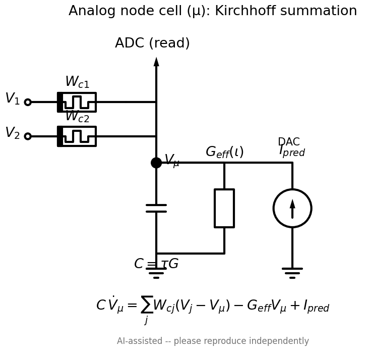

*Figure A1. Analog node cell (μ) — Kirchhoff current summation: memristor weights
W_cj, integrator capacitor C=τG, leak/precision conductance G_eff(ι), DAC current
I_pred, ADC tap. Realizes the §A.5 node dynamics.*

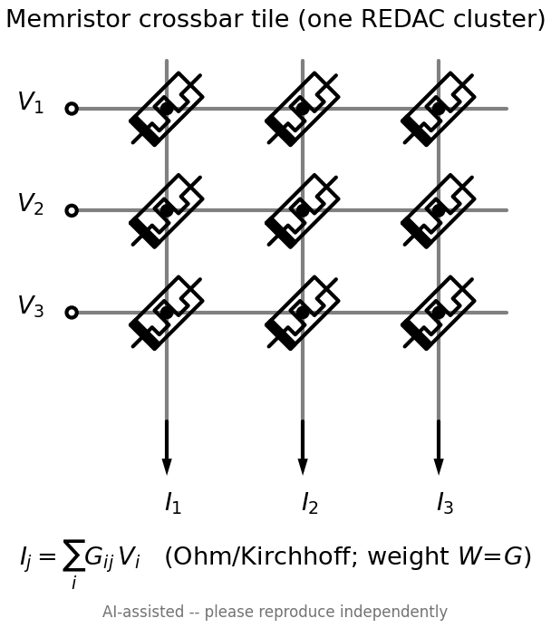

*Figure A2. Memristor crossbar tile (one REDAC cluster): the weight matrix W=G as a
crossbar; column current I_j = Σ_i G_ij·V_i (Ohm/Kirchhoff) — the physical
matrix–vector product of §A.5.*

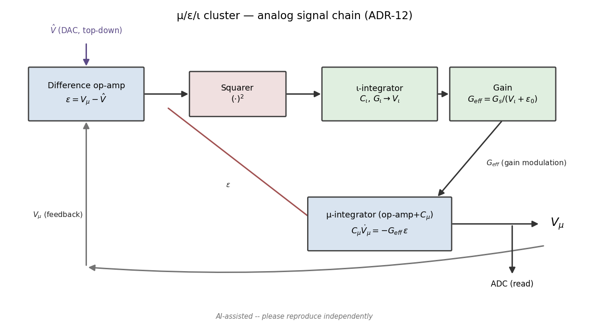

*Figure A3. μ/ε/ι cluster as an analog signal chain (§A.1–A.3): difference op-amp
(ε), squarer + ι-integrator (variance → precision), gain G_eff, μ-integrator, with
V_μ feedback. ADC/DAC at the boundary.*

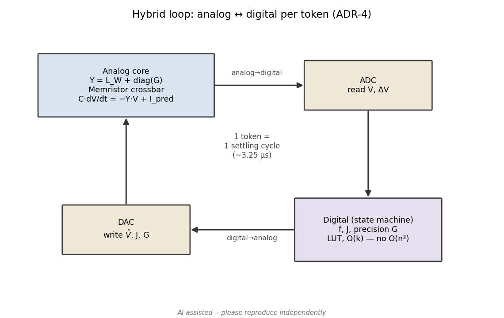

*Figure A4. Hybrid loop per token (ADR-4, §A.4–A.5): analog core (Y, crossbar) → ADC
→ digital (f, J, precision) → DAC → analog. One token = one settling cycle
(~3.25 µs).*

<div style="page-break-before: always"></div>

## Appendix B — Experimental methods and metrics (formulas)

The experiments (B-3…B-13) evaluate a fixed-weight leaky-ESN reduction of the model
(§2). The formulas they use:

**Reservoir update (leaky ESN).**
```
x(t) = (1−a)·x(t−1) + a·tanh( W·x(t−1) + W_in·u(t) )
```
leak a_i = 1/τ_i (from the τ-gradient) or fixed; spectral scaling W ← W·(ρ*/ρ(W))
to a target spectral radius ρ* ≈ 0.9 (edge of chaos). Readout: ridge regression on
z-standardized states.

**Memory Capacity (MC).**
```
delayed-copy (B-3/7/10/12):  target = u(t−k);  MC = Σ_k max(acc_k − 1/V, 0)/(1 − 1/V)
linear (B-13):               MC = Σ_k corr²( û(t−k), u(t−k) ) ,  bound  MC ≤ N  (Dambre)
```

**NARMA-n** (nonlinear benchmark, tanh-stabilized; demo, B-12, B-13):
```
y(t+1) = tanh( 0.3·y(t) + 0.05·y(t)·Σ_{i=0}^{n−1} y(t−i) + 1.5·u(t−n+1)·u(t) + 0.1 )
NRMSE  = sqrt( mean( (ŷ−y)² ) ) / std(y)
```

**Hardware mapping (Goal 2).**
```
Tile cut       = |{(i,j)∈E : tile(i)≠tile(j)}| / |E|
FM gain(node→T)= (#neighbours in T) − (#neighbours in own tile)   [cap ≤ 144 nodes/tile]
Energy proxy   E = ½·C·V²  (cap. switching),  node capacitance C = τ·G
  E_total/token = E_compute + E_wire + E_photonic + E_converter + E_static + E_digital
  E_static = N·P_static·t_settle ,   E_photonic = n_links·bits·E_eoe
```

**Learning and reservoir variants.**
```
in-situ Hebbian (B-10):  ΔW_ij = η·x_i(t)·x_j(t−1) − κ·(W_ij − W0_ij)
                         (existing edges only; periodic spectral renorm to ρ*)
cycle reservoir (B-13):  W_{i,i−1} = r   (ring);   orthogonal: W = ρ·Q  (Q from QR)
delay-tap readout:       features = [ x(t), u(t−1), …, u(t−D) ]
"multiverse" (B-12):     block-diagonal W (K modules) + sparse inter-module bridges
                         (Q ports each) + per-module graded leak (timescale gradient)
```

Full model derivations: Appendix A and `fractal_llm.md`.

<div style="page-break-before: always;"></div>

## Appendix C — Glossary

Short definitions of the recurring terms (alphabetical).

| Term | Meaning |
|------|---------|
| **Box-counting dimension** | Practical estimate of the fractal dimension `d_H`: slope of `log N(ε)` vs. `log(1/ε)`, where `N(ε)` is the number of boxes of side `ε` needed to cover the point cloud. |
| **Crossbar (memristor crossbar)** | Grid of row and column wires with a memristor at each crossing. Performs a matrix–vector multiply in a single analog step (Ohm + Kirchhoff). |
| **Dambre bound** | Upper limit on a reservoir's total capacity: linear + nonlinear capacity sums to `≤ N` (number of nodes). More linear memory costs nonlinearity. |
| **Delay taps** | Digital delay buffers that feed past inputs `u(t−1)…u(t−D)` directly to the readout as features — external memory instead of more reservoir nodes (B-13, ADR-3). |
| **Echo State Property (ESP)** | Condition that the reservoir state is determined solely by the input history (initial conditions fade). Prerequisite for reproducible, trainable behavior. |
| **Edge of chaos** | Dynamical operating point near `ρ ≈ 1` where reservoirs typically show the best memory/compute. Here `ρ* ≈ 0.9`. |
| **Ensemble** | Several independent reservoirs run in parallel with combined outputs — a fair comparison point against modular coupling. |
| **ESN (Echo State Network)** | Reservoir-computing variant: a fixed, randomly initialized recurrent network; only the linear output layer (readout) is trained. |
| **Fading memory** | Property that inputs further in the past influence the current state less — equivalent to usable, finite memory. |
| **flat_match** | Fair baseline: a single reservoir with *identical* node count, edge count, leak, and input as the test variant — only the connectivity differs. |
| **Fractal dimension `d_H`** | Measure of self-similarity / space-filling of a structure (~1.8–2.2 for the cosmic web here). See box-counting. |
| **Graded leak (timescale gradient)** | Per-module leak rates set differently so modules span different timescales — the actual lever of the tuned "multiverse". |
| **Leak rate `a` (`a = 1/τ`)** | Mixing factor of the leaky-integrator update `x ← (1−a)·x + a·tanh(…)`. Small `a` = long time constant `τ` (slow memory), large `a` = fast response. |
| **Leaky integrator** | A neuron with inertia: the new state is a weighted blend of the old state and the new activation (see leak rate). |
| **MC (Memory Capacity)** | Memory capacity: measures, in "time steps", how much of the input history is linearly reconstructable from the current state. `MC = Σ_k corr²(u(t−k), û_k)`, capped by `MC ≤ N`. |
| **Memristor** | Two-terminal device with a tunable, non-volatile resistance — the analog weight in the crossbar. |
| **"Multiverse"** | Exploratory idea: several reservoir modules ("universes"), block-diagonally coupled, linked through a few bridges ("quasars"); optionally nested hierarchically. |
| **NARMA-n** | Nonlinear auto-regressive benchmark with memory horizon `n` (NARMA-10/20/30). Tests whether a system combines nonlinearity *and* memory. |
| **NRMSE** | Normalized root-mean-square error; error metric for NARMA and similar tasks (smaller = better). |
| **Orthogonal / cycle reservoir** | Special recurrent structures (ring resp. orthogonal matrix) that nearly maximize the linear MC (~96–99% of `N`) — B-13. |
| **Photonic interconnect** | Optical link for the rare, long-range inter-module communication (B-2) — the "quasar" bridges in hardware. |
| **Quasar (bridge)** | The few surface ports through which modules exchange information. The count `Q` is capacity-neutral → keep minimal (hardware-driven). |
| **REDAC** | Reconfigurable Analog Computer; here: 1 REDAC ≈ one 19″ rack; the full network ≈ 2 racks. |
| **Reservoir computing** | Paradigm: a fixed nonlinear dynamical system ("reservoir") maps the input into a high-dimensional state; only a linear readout is trained. |
| **Readout** | The trainable linear output layer that reconstructs the target from the reservoir state. |
| **Spectral radius `ρ`** | Magnitude of the largest eigenvalue of the reservoir matrix `W`; controls stability and memory. Weights are scaled to `ρ*` (`W ← W·ρ*/ρ(W)`). |
| **SPICE proxy** | Circuit simulation as a stand-in for the real energy/power demand of the analog hardware (B-9). |
| **Tile / FM partitioning** | Splitting the network across hardware tiles; Fiduccia–Mattheyses refinement minimizes the expensive cut edges between tiles. |
| **TRL** | Technology Readiness Level (1–9); maturity rating of the exploitation steps (§5.1). |

*Full formulas: Appendix B. Model derivation: Appendix A.*

